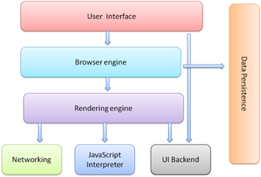
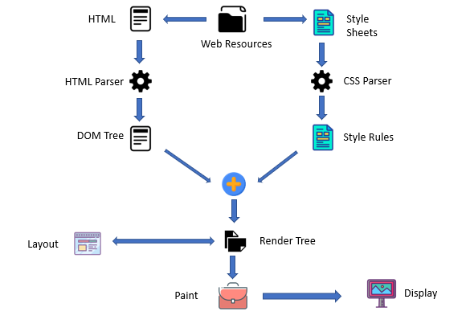

When a user enters an URL in the browser, how does the browser fetch the desiredresult ? 

=> You can go anyplace on the internet with a web browser. It gathers data from many places of the internet and displays it on your computer or mobile device. The data is sent via the Hypertext Transfer Protocol, which specifies how text, pictures, and video are sent over the internet. This information must be shared and displayed in a standard style so that individuals from all over the world may access it using any browser.

A browser's primary components include:
 
The forward and back buttons, bookmarks, address bar, and the window that displays the requested website are all part of the user interface.

The rendering engine and the user interface are controlled by the browser engine.

Rendering engine - The rendering engine's primary duty is to show the desired content. When an HTML content request is made, for example, the engine parses CSS and HTML before displaying the content on the screen.
Networking - It uses internet protocols like HTTP or FTP to fetch URLs. It is in charge of ensuring that all areas of Internet communication and security are maintained. It can also be used to cache a retrieved document in order to save network traffic.

JavaScript Interpreter - does exactly what its name implies: it interprets and executes JavaScript code that is embedded in a website. The rendered engine receives the translated findings and displays them on the device screen.
UI Backend - Basic combo boxes and Windows are drawn using the UI Backend (widgets). It specifies a platform-independent interface.
Data Storage - The data storage layer is a persistence layer that allows the browser to retain local data such as cookies. Different storage systems, such as IndexedDB, WebSQL, localStorage, and FileSystem, are also supported by browsers. It's a database saved on your computer's local storage, where the browser is installed. It manages cache, bookmarks, cookies, and settings for users.

Rendering - When we type a domain name into a browser, it retrieves and loads a number of assets, including HTML, CSS, and JS files, images, and icons. 
 

HTML files would be parsed and converted into a DOM tree as a first step, called as the content tree. The DOM is not only the page's internal structure, but also an API that Javascript can use to query or modify the rendering via a system called "bindings."

After the DOM tree, the CSS styles must be processed. Browsers feature a CSS parser that creates a model of the style rules for this purpose. After creating a model for style rules, we can combine them with a set of default styles provided by the browser to determine the final value of each style attribute for each DOM element. This is known as style resolving (or recalc).

The visual geometry of all the elements must be determined in the next layout section. At this point, each element is given its x and y coordinates, width, and height. All overflow regions are calculated and recorded by the layout engine, including which parts are visible and which are not.

It's time to start painting now that we have all of the coordinates for all of the elements. We combine the coordinates from the previous step with the colour from the style rules to create a list of painting instructions for this operation. It's critical to paint parts in the correct order so that when they overlap, they stack correctly. The z-index style rule can be used to change the order.

Let's go through our list of painting instructions and transform them to a color-valued bitmap. This stage is referred as a raster. At this point, we additionally decode our photos into bitmap.

The rastered bitmap will be saved in GPU memory later. On Windows, this tier contains libraries that encapsulate the hardware and calling OpenGL and DirectX. When the GPU receives the bitmap display instructions, it paints pixels on your screen.

We now have the most crucial components of the rendering pipeline. Rendering is not a static process. Animation frames are used to represent change.
